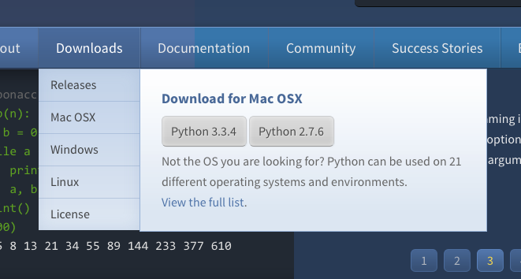

Administration
==============

.. _navigation:

Navigation
----------

Navigation on the site is managed by the `Sitetree  <https://pypi.org/pypi/django-sitetree>`_ application.  The hierarchy should be fairly obvious.  The biggest gotcha is when defining the URLs.

Many URLs are defined using `Django's URL system <https://docs.djangoproject.com/en/dev/topics/http/urls/>`_ however many are also simply defined as relative paths.  When editing a particular item in the Sitetree in the *Additional Settings* fieldset there is an option named *URL as pattern*.  If this option is checked the URL pattern is checked against the URLs defined by the Django applications. If it is left unchecked relative and absolute URLs can be entered.

.. _supernav:

Supernavs
---------

The concept of a *Supernav* is used heavily on the site.  These are the larger bits of text and markup included in the main navigation drop downs.  These are implemented as specially named :ref:`boxes`.  They are by convention named ``supernav-*``, for example ``templates/downloads/supernav.html``.

Here is an example of what that looks like on the site.

The sub-nav items on the left are simply nested :ref:`navigation` links in SiteTree relative to the 'Download' item in the tree.  The larger *Download for macOS* box however is what we refer to as the *supernav*.

Most supernavs are updated automatically based on the underlying Django application content using signals.
By convention the application will have a template named ``supernav.html``. For example, upon saving any published :ref:`Release <downloads>` a Django signal is fired to update the ``supernav-python-downloads`` box with the most current Python2 and Python3 releases.  In this case the markup is structured in a way to allow for the automatic OS detection Javascript to show the user the appropriate download links for the OS they are browsing with.

.. _pages:

Pages
-----

Pages are individual entire pages of markup content.  They are require ``Title``, ``Path``, and ``Content`` to be acceptable in the system.  Note that Pages are implemented using a fall through system of URL routing so a user cannot override an existing defined Django URL on accident with a Page.

**Fields and Descriptions**

:Title:
    Title of the Page.  Will also be used as the ``<title></title>`` attribute in the markup.
:Keywords: HTML META keywords for search engines
:Description: HTML META description for search engines
:Path: Relative URL path where the page will reside, excluding the initial slash.  *Example*: ``about/psf/somepage/``
:Content: The actual content of the page.
:Markup Type: Type of markup contained in the *Content* field.  Options are: HTML, plain text, ReStructured Text, and Markdown
:Is Published: Controls whether or not the page is visible on the site.
:Template Name: By default Pages use the template ``templates/pages/default.html`` to use a different template enter the template path here.

.. note:: Pages are automatically purge from Fastly.com upon save.

.. _boxes:

Boxes
-----

Boxes are re-usable bits of HTML markup that are used throughout the site.  Things like sidebar info and specific areas of areas of pages with a richer design (i.e. landing pages) that would be cumbersome to edit as one large content textarea.

.. note:: There are *special boxes* that are automatically rebuilt using templates, see :ref:`supernav`.

.. _downloads:

Downloads and Releases
----------------------

The ``downloads`` app stores all of the structured data regarding Python releases.  Each ``Release`` object has associated ``ReleaseFile`` objects that contain information on the various download formats Python.org
supports.

If the version you are creating should be considered the "latest" release for the major version in question (Python 2.x.x, 3.x.x, etc)
then check the 'Is this the latest release' checkbox.  When the ``Release`` is saved, the previous version will be automatically
demoted for you and the new version will be used prominently on the site.  For example the download buttons and supernav links.

.. note::
   If you make a mistake here, no worries you can just check the box and save
   on **ANY** version and promote it to being the latest release.

To create a release you simply need to fill in the appropriate information.  Currently if a ``Release`` has an associated ``Release Page`` the system redirects to that to accommodate legacy content, but if the ``Content`` field is filled they are taken to the Release Detail page which shows the content and lists all of the associated downloadable files.

Release Files have a checkbox named 'Download button' that determines which binary/source package download link to display for a given OS.  This information is used by the OS detection JS on the site so pick the package in most widespread use. On Source distributions be sure to check the 'Download button' for the .tgz version for widest compatibility.

.. _jobs:

Jobs
----

The jobs application is using to display Python jobs on the site. The data items should be fairly self explanatory. There are a couple of things to keep in mind. Logged in users of the site can submit jobs for review.

:Status: Jobs enter the system in 'review' status after the submitter has entered them. Only jobs in the 'approved' state are displayed on the site.
:Featured: Featured jobs are displayed more prominently on the landing page.
:Comments: Users who have submitted a job and admin reviewers can make comments on a job. Emails will be sent to the other party in order to foster communication about job description and data.

Sponsors
--------

The Sponsors app is a place to store PSF Sponsors. Sponsors have to be associated to a Company model from
the companies app.  If they are marked as `is_published` they will be shown on the main sponsor page which
is located at /sponsors/.

If a Sponsor is marked as `featured` they will be included in the sponsor rotation on the main PSF landing
page.  In the fourth "Sponsors" column.

Events
------

TODO

Companies
---------

TODO

Success Stories
---------------

TODO
