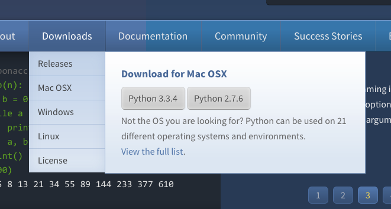

Administration
==============

.. _navigation:

Navigation
----------

Navigation on the site is managed by the `Sitetree  <https://pypi.org/project/django-sitetree/>`_ application.  The hierarchy should be fairly obvious.  The biggest gotcha is when defining the URLs.

Many URLs are defined using `Django's URL system <https://docs.djangoproject.com/en/dev/topics/http/urls/>`_ however many are also simply defined as relative paths.  When editing a particular item in the Sitetree in the *Additional Settings* fieldset there is an option named *URL as pattern*.  If this option is checked the URL pattern is checked against the URLs defined by the Django applications. If it is left unchecked relative and absolute URLs can be entered.

.. _supernav:

Supernavs
---------

The concept of a *Supernav* is used heavily on the site.  These are the larger bits of text and markup included in the main navigation drop downs.  These are implemented as specially named :ref:`boxes`.  They are by convention named ``supernav-*``, for example ``templates/downloads/supernav.html``.

Here is an example of what that looks like on the site.

The sub-nav items on the left are simply nested :ref:`navigation` links in SiteTree relative to the 'Download' item in the tree.  The larger *Download for macOS* box however is what we refer to as the *supernav*.

Most supernavs are updated automatically based on the underlying Django application content using signals.
By convention the application will have a template named ``supernav.html``. For example, upon saving any published :ref:`Release <downloads>` a Django signal is fired to update the ``supernav-python-downloads`` box with the most current Python2 and Python3 releases.  In this case the markup is structured in a way to allow for the automatic OS detection Javascript to show the user the appropriate download links for the OS they are browsing with.

.. _pages:

Pages
-----

Pages are individual entire pages of markup content.  They are require ``Title``, ``Path``, and ``Content`` to be acceptable in the system.  Note that Pages are implemented using a fall through system of URL routing so a user cannot override an existing defined Django URL on accident with a Page.

**Fields and Descriptions**

:Title:
    Title of the Page.  Will also be used as the ``<title></title>`` attribute in the markup.
:Keywords: HTML META keywords for search engines
:Description: HTML META description for search engines
:Path: Relative URL path where the page will reside, excluding the initial slash.  *Example*: ``about/psf/somepage/``
:Content: The actual content of the page.
:Markup Type: Type of markup contained in the *Content* field.  Options are: HTML, plain text, ReStructured Text, and Markdown
:Is Published: Controls whether or not the page is visible on the site.
:Template Name: By default Pages use the template ``templates/pages/default.html`` to use a different template enter the template path here.

.. note:: Pages are automatically purged from Fastly.com upon save.

.. _boxes:

Boxes
-----

Boxes are re-usable bits of HTML markup that are used throughout the site.  Things like sidebar info and specific areas of areas of pages with a richer design (i.e. landing pages) that would be cumbersome to edit as one large content textarea.

.. note:: There are *special boxes* that are automatically rebuilt using templates, see :ref:`supernav`.

.. _downloads:

Downloads and Releases
----------------------

The ``downloads`` app stores all of the structured data regarding Python releases.  Each ``Release`` object has associated ``ReleaseFile`` objects that contain information on the various download formats Python.org
supports.

If the version you are creating should be considered the "latest" release for the major version in question (Python 2.x.x, 3.x.x, etc)
then check the 'Is this the latest release' checkbox.  When the ``Release`` is saved, the previous version will be automatically
demoted for you and the new version will be used prominently on the site.  For example the download buttons and supernav links.

.. note::
   If you make a mistake here, no worries you can just check the box and save
   on **ANY** version and promote it to being the latest release.

To create a release you simply need to fill in the appropriate information.  Currently if a ``Release`` has an associated ``Release Page`` the system redirects to that to accommodate legacy content, but if the ``Content`` field is filled they are taken to the Release Detail page which shows the content and lists all of the associated downloadable files.

Release Files have a checkbox named 'Download button' that determines which binary/source package download link to display for a given OS.  This information is used by the OS detection JS on the site so pick the package in most widespread use. On Source distributions be sure to check the 'Download button' for the .tgz version for widest compatibility.

.. _jobs:

Jobs
----

The jobs application is used to display Python jobs on the site. The data items should be fairly self explanatory. There are a couple of things to keep in mind. Logged in users of the site can submit jobs for review.

:Status: Jobs enter the system in 'review' status after the submitter has entered them. Only jobs in the 'approved' state are displayed on the site.
:Featured: Featured jobs are displayed more prominently on the landing page.
:Comments: Users who have submitted a job and admin reviewers can make comments on a job. Emails will be sent to the other party in order to foster communication about job description and data.

Sponsors
--------

The Sponsors app is a place to store PSF Sponsors and Sponsorships. This is the most complex app in the
project due to the multiple possibilities on how to configure a sponsorship and, to support this, the
app has a lot of models that are grouped by context. Here's a list of the group of models and what do
they represent:

:sponsorship.py: The `Sponsorship` model and all the related information to configure a new sponsorship
                 application like programs, packages and benefits;
:benefits.py: List models that are used to configure benefits. Here you'll find models that forces a
              benefit to have an asset or controls it maximum quantity;
:assets.py: Models that are used to configure the type of assets that a benefit can have;
:sponsors.py: Has the `Sponsor` model and all related information such as their contacts and benefits;
:notifications.py: Any type of sponsor notification that's configurable via admin;
:contract.py: The `Contract` model which is used to generate the final contract document and other
              support models;

Agreements
----------

The ``agreements`` app handles configurable order forms and custom contracts: preparation,
revisions, signatures, and countersignatures. Management access at ``/agreements/`` is
controlled only by membership in these groups:

* **Agreements Editors** can read agreement records, private programs, and terms; prepare,
  edit, and discard unoffered order and custom-contract drafts; and save or preview terms
  drafts. They cannot publish terms, change configuration, offer documents for others,
  revise offered documents, send signing links, record others' signatures, or countersign.
* **Agreements Administrators** have those preparation rights and can manage configuration,
  publish terms, offer documents, revise unsigned offers, send signing links, record signed
  copies, decline, withdraw, countersign, and resend executed copies.

Migrations create both groups without permissions or members and remove the obsolete
``agreements.manage_agreement`` permission. After deployment, explicitly add the appropriate
users to these groups in the Django admin. No users are enrolled automatically, and no
programs, terms, pricing, or agreements are seeded. Direct permissions, other groups'
model permissions, ``is_staff``, and superuser status do not grant agreement-management
access. Even superusers must join an agreement group. Django admin access additionally
requires an active staff account; the site workflow does not require ``is_staff``.

Authenticated accounts outside both groups receive a permission-denied page for management
views; anonymous visitors are directed to sign in. Linked customers retain their own
order and signing rights independently of group membership, as do valid one-time
signing links. Removing group membership removes management access on the next request;
historical authorship or offering does not retain access. Agreement, order, and custom-contract
records are read-only in the Django admin; use the site workflow to change their state.

:Programs: Agreements Administrators create and edit programs in the Django admin. A program's
           name, catalog, prices, service descriptions, discounts, and document copy are database
           configuration, not application source. Programs are private by default. Enabling *is public*
           makes a program browsable at ``/agreements/programs/<slug>/`` and lets signed-in
           customers start orders. Publish the cited terms separately before making a program
           public. Staff can prepare private orders for a linked customer without exposing
           the program's catalog to everyone.
:Packages: Customers move through Services, Extras, Term, Organization, and Contacts & billing
           before reviewing the saved Order Form. Service comparisons expand beneath the tier
           cards; optional extras are visible on their own step. Back, Next, and browser history
           preserve entries, and validation reveals the field that needs attention.
           Staff account linkage and contract adjustments are in a collapsed, staff-only section
           of Contacts & billing.
           New packages start empty unless a service is explicitly preselected. Choosing a
           tier includes its service; extras included at that tier are not charged again.
           The live summary, saved order, and newly generated Order Form separate recurring
           and one-time fees, and show prepaid totals for multi-year terms. Existing frozen
           documents and fee snapshots are not rewritten. Review identifies the terms
           required by the selections.
           Without JavaScript, all sections appear together: use each service's inclusion
           checkbox and review fees on the next page. Existing private-order access
           restrictions still apply.
:Terms: Create a set of terms in the admin, then edit its text at ``/agreements/terms/``.
        Save a private draft or publish an immutable version with a label and change note.
        Unpublished sets open in the draft editor. Creating a set requires membership in
        Agreements Administrators and Django admin access; editors should ask an administrator.
        Once a version is published, its terms slug is read-only in the admin so cited
        addresses remain permanent. The draft editor is at
        ``/agreements/terms/<slug>/edit/draft/``; ``edit`` is also a valid version label.
        Publishing a version does not make it public: the separate *Make published versions
        public* setting controls that. Private versions are readable only by agreement group
        members and linked parties to documents citing them. An emailed signatory can review the cited versions through
        their signing link. Permanent addresses are
        ``/agreements/terms/<slug>/<version>/``. Documents cite the address and version;
        integrity hashes are retained internally rather than shown to signatories.
        Public terms responses are publicly cacheable only for anonymous visitors.
        Responses to signed-in users are private and must not be stored by shared caches.
:Offering: Making a draft ready to sign freezes its document, complete program configuration,
           fees, and cited terms versions. Later catalog or terms changes do not affect it.
           Withdrawing an unsigned offer returns it to draft and disables signing links;
           a new offer uses current configuration.
           Order signing and offering check current account authorization while holding the
           draft lock; a removed or reassigned customer cannot use a stale request.
:Editing: Before signing, Agreements Administrators can edit an offered document for that counterparty only.
          Each save records a revision and note. Signing requires the exact revision the
          signatory reviewed. Signed text cannot be edited.
          If another administrator saves first, the editor preserves your text and note,
          displays the current revision and a comparison, and asks you to review or merge
          before replacing it. Another intervening edit still requires a fresh review.
          Embedded images are not supported; editors report them as field errors before
          saving or previewing rather than leaving an unrenderable document.
:Document display: Pages and emails use the reference printed in the document when present.
                   Browser views omit generated fingerprint metadata from older documents;
                   their stored text and complete PDF/DOCX downloads remain intact.
:Signing: Use the linked python.org account, an emailed one-time link (valid for 14 days),
          or a signed PDF collected through another signing service or on paper.
          Linked customers and Agreements Administrators can upload signed copies. Copies stay in the
          database, not public media storage.
          If an invitation email fails, the page reports the failure and removes the
          undelivered, unused link. Existing invitations remain valid; send a new link
          to retry delivery.
          Signing-link pages, their cited terms, and their error responses omit analytics
          and advertising scripts so those scripts cannot report signing credentials.
          If the document changes during link signing, the refreshed form keeps the
          signatory's entered name and title but requires acceptance of the new text.
          Confirmation shows the recorded signatory, even if different from the invitation.
:Countersigning: The staff queue lists documents awaiting the PSF's signature. Countersigning
                 can include a fully executed uploaded copy and emails that exact PDF,
                 including external signatures and audit pages. Without an uploaded
                 executed copy, the application generates the signed PDF.
                 Delivery also includes PDFs of every terms version cited by that agreement,
                 not newer published versions. Keep the full bundle: private online terms
                 may be inaccessible after a one-time signing link is used.
                 If rendering or email delivery fails, the countersignature still stands.
                 Use **Email signed copy** on the executed agreement to retry delivery
                 without signing again. This action is available only to Agreements Administrators.
:Custom contracts: Write one-off contracts at ``/agreements/contracts/new/``, optionally
                   incorporating versioned terms. Creation, editing, and deletion use
                   this workflow; the Django admin is read-only. Linked customers return
                   to their accessible agreement record after signing, uploading a copy,
                   or withdrawing an offer.
:New kinds: Other applications can register an ``apps.agreements.registry.Kind`` for a
            model with an ``agreement`` field; see ``apps/agreements/orders/kinds.py``.

Private configuration imports
~~~~~~~~~~~~~~~~~~~~~~~~~~~~~

Keep commercial configuration and legal drafts outside the public repository, including
migrations, fixtures, examples, and tests. Import an operator-supplied JSON file with::

    python manage.py import_agreement_program /private/path/program.json

Use ``-`` instead of a path to read stdin. Imports are atomic. An existing terms version
must match exactly; changing its text requires a new version label. Updating program
configuration does not rewrite offered orders.

The root object contains ``program`` and an optional ``terms`` list:

* ``program``: ``slug``, ``title``, ``description``, ``is_public`` (false by default),
  and ``definition``.
* Each terms entry: ``slug``, ``title``, optional ``under_review`` and ``is_public``,
  and ``versions`` containing ``version``, ``markdown``, and optional ``notes``.
* ``definition``: ordered ``agreements`` and shared ``discounts`` lists. Optional document
  copy fields are ``order_title``, ``order_intro``, ``covered_entities_label``,
  ``covered_entities_help``, ``attestation_label``, ``attestation_help``, and ``payment``
  (``annual``, ``multi_year``, ``renewal``, ``other_charges``).
* Each catalog agreement: ``slug``, ``title``, ``terms_slug``, and ``tiers``; optional
  ``short_name``, ``tagline``, ``default_tier``, ``services``, and ``addons``.
* Each tier: ``key``, ``name``, ``annual_fee`` as a decimal string, four
  ``response_targets``, ``fair_use``, and optional ``includes``.
* Each service: ``key``, ``name``, ``description``, and optional ``tiers`` restricting
  which tiers include it.
* Each discount: ``key``, ``name``, integer ``percent``, ``term_months`` (a positive multiple
  of 12), and optional ``requires_attestation``. Discounts apply to tier fees only.
* Each add-on: ``key``, ``name``, ``description``, ``price_summary``, ``pricing``, optional
  ``included_in_tiers``, and ``params``. Parameters have ``key``, ``label``, ``kind``
  (``choice``, ``count``, ``text``, or ``lines``), optional ``choices`` pairs,
  ``help_text``, ``minimum``, and ``required_when`` parameter/value conditions.

Pricing uses declarative rules, never executable expressions:

* ``fixed``: ``amount``.
* ``quantity``: ``parameter`` and ``unit_amount``; optional ``base_amount`` and
  ``included`` quantity. A lines parameter is priced by its number of entries.
* ``brackets``: ``parameter``, ascending ``bands`` of ``up_to`` and ``amount``,
  and an ``overflow_basis`` explaining separately quoted quantities.
* ``choice``: ``parameter`` and ``options`` mapping every choice to another pricing rule.
* ``sum``: ``components`` sharing the same recurrence.
* ``unpriced``: descriptive billing ``basis``, with no upfront amount.

Except for ``choice`` wrappers, rules accept ``recurring``, ``basis``, and ``detail``.
Money values are finite, nonnegative decimal strings with at most two decimal places.
One-time charges are billed once even for multi-year terms. See the fictional catalog in
``apps/agreements/tests/catalog_data.py`` for a complete schema example.

Events
------

TODO

Companies
---------

TODO

Success Stories
---------------

TODO
